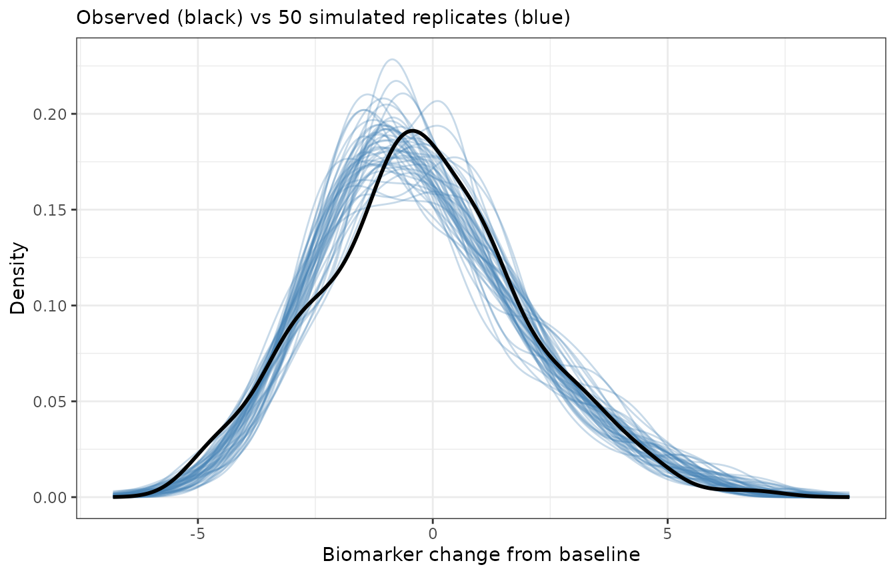
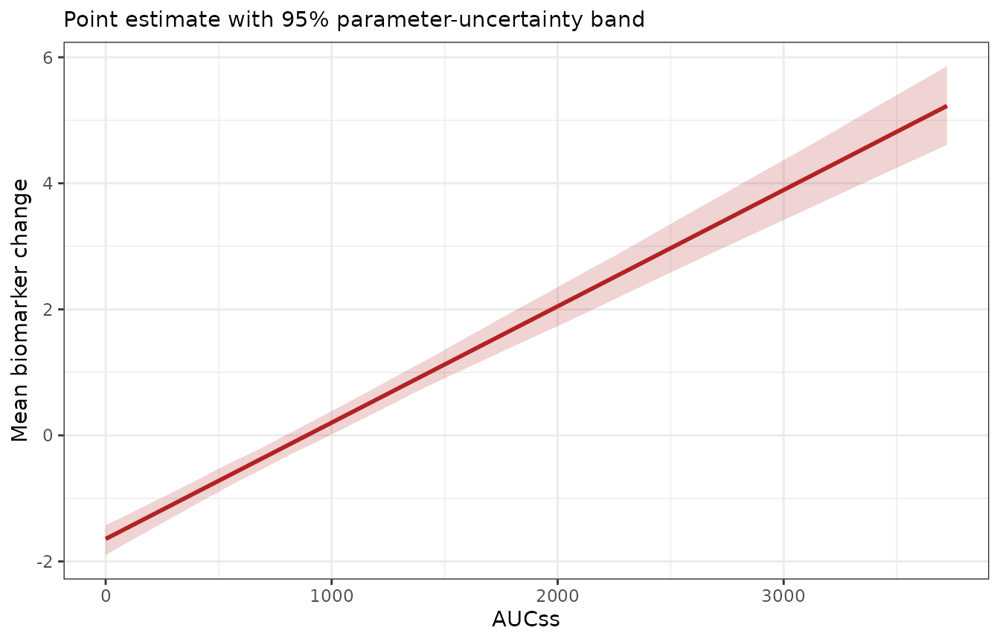

# Simulation

``` r

library(erglm)
library(tibble)
library(ggplot2)
theme_set(theme_bw())
```

Once a model has been fitted, it’s often useful to generate *new* data
from it: for predictive checks, for simulation-based intervals, or as
the input to some downstream analysis. The package offers two tools for
this, operating at different levels:

- **[`simulate()`](https://rdrr.io/r/stats/simulate.html)** is the
  high-level method. It generates complete replicate datasets from a
  fitted model, automatically propagating both the uncertainty in the
  parameter estimates and the observation-level noise.
- **[`erglm_fun()`](https://erglm.djnavarro.net/reference/erglm_fun.md)**
  is the low-level building block. It extracts the deterministic
  prediction function from a fitted model, letting you evaluate it at
  any parameter values and any data you choose – the raw material for
  building custom simulations by hand.

Both rely on the **mvtnorm** package for drawing parameter values, so it
needs to be installed. This article works through both tools using a
gaussian model, then shows that they generalise unchanged to the other
[`glm()`](https://rdrr.io/r/stats/glm.html) families erglm supports.

``` r

mod <- erglm_model(biomarker_change ~ aucss, erglm_data, family = gaussian())
```

## The `simulate()` method

Calling [`simulate()`](https://rdrr.io/r/stats/simulate.html) generates
one or more replicate datasets. The number of replicates is set by
`nsim`, and a `seed` can be supplied for reproducibility:

``` r

sim1 <- simulate(mod, nsim = 1, seed = 1)
sim1
#> # A tibble: 300 × 7
#>    dat_id sim_id     mu      val `coef_(Intercept)` coef_aucss aucss
#>     <int>  <int>  <dbl>    <dbl>              <dbl>      <dbl> <dbl>
#>  1      1      1 -0.437 -1.69                 -1.72    0.00190  673.
#>  2      2      1  3.62   6.00                 -1.72    0.00190 2806.
#>  3      3      1 -1.72  -1.22                 -1.72    0.00190    0 
#>  4      4      1  0.505 -0.722                -1.72    0.00190 1169.
#>  5      5      1 -0.999 -0.270                -1.72    0.00190  377.
#>  6      6      1 -1.09   0.00974              -1.72    0.00190  327.
#>  7      7      1 -1.72  -0.855                -1.72    0.00190    0 
#>  8      8      1  0.579  0.122                -1.72    0.00190 1208.
#>  9      9      1 -1.72   0.545                -1.72    0.00190    0 
#> 10     10      1 -1.23  -0.651                -1.72    0.00190  254.
#> # ℹ 290 more rows
```

### What `simulate()` actually does

Generating a replicate involves two distinct sources of randomness, and
[`simulate()`](https://rdrr.io/r/stats/simulate.html) accounts for both:

1.  **Parameter uncertainty.** A fresh parameter vector is drawn from
    the multivariate normal distribution implied by the estimates and
    their covariance matrix, using `coef(mod)` and `vcov(mod)`. This
    represents how uncertain we are about the fitted parameters
    themselves.
2.  **Observation noise.** Given that parameter draw, the expected
    response $`\mu_i`$ is evaluated at each observation’s exposure and
    covariates, and a response is generated around it. The noise model
    is family-appropriate: Bernoulli draws for `binomial`, Poisson draws
    for `poisson`, normal draws for `gaussian` (as here), and gamma
    draws for `Gamma`.

Because both sources are included, the simulated `val` column behaves
like a genuine new dataset drawn from the fitted model, not merely a
noiseless prediction.

### The output format

The result is a tidy, long-format tibble with `nsim`$`\times`$`nobs`
rows:

``` r

names(sim1)
#> [1] "dat_id"           "sim_id"           "mu"               "val"             
#> [5] "coef_(Intercept)" "coef_aucss"       "aucss"
```

The columns are:

- `dat_id` – an index identifying the original observation (row of the
  data).
- `sim_id` – which replicate the row belongs to (`1` to `nsim`).
- `mu` – the expected response (response scale) for that observation
  under the sampled parameters.
- `val` – the simulated response (the mean plus family-appropriate
  noise).
- the sampled coefficient values, prefixed `coef_*`
  (e.g. `` coef_`(Intercept)` ``, `coef_aucss`) to avoid colliding with
  predictor columns of the same name, repeated across all rows of a
  replicate – one parameter draw is used per replicate.
- the model’s predictor columns (`aucss`), carried along so you can
  group or plot by exposure and covariates.

Requesting several replicates stacks them, and the sampled coefficients
vary from one replicate to the next while staying constant within a
replicate:

``` r

sims <- simulate(mod, nsim = 50, seed = 1)
dim(sims)
#> [1] 15000     7

# one parameter draw per replicate
unique(sims[sims$sim_id <= 3, c("sim_id", "coef_(Intercept)", "coef_aucss")])
#> # A tibble: 3 × 3
#>   sim_id `coef_(Intercept)` coef_aucss
#>    <int>              <dbl>      <dbl>
#> 1      1              -1.72    0.00190
#> 2      2              -1.74    0.00202
#> 3      3              -1.61    0.00176
```

### A predictive check

A natural use of these replicates is a *predictive check*: if the model
is adequate, the distribution of simulated responses should resemble the
distribution of the observed response. Overlaying the density of the
observed `biomarker_change` on the densities of several simulated
replicates gives a quick visual check:

``` r

ggplot(sims, aes(val, group = sim_id)) +
  geom_line(stat = "density", colour = "steelblue", alpha = 0.3) +
  geom_line(
    aes(biomarker_change),
    data = erglm_data,
    stat = "density",
    inherit.aes = FALSE,
    colour = "black",
    linewidth = 1
  ) +
  labs(
    x = "Biomarker change from baseline",
    y = "Density",
    subtitle = "Observed (black) vs 50 simulated replicates (blue)"
  )
```



The observed distribution sits comfortably within the spread of the
simulated replicates, which is what we’d hope to see from a well-fitting
model.

## The `erglm_fun()` tool

Where [`simulate()`](https://rdrr.io/r/stats/simulate.html) bundles
parameter sampling and noise generation together,
[`erglm_fun()`](https://erglm.djnavarro.net/reference/erglm_fun.md)
exposes the deterministic core: the prediction function itself. It
returns a function of two arguments, `param` and `data`, both of which
default to the values used when the model was fitted:

``` r

f <- erglm_fun(mod)

# with no arguments, it reproduces the fitted values
head(f())
#> [1] -0.4013  3.5360 -1.6437  0.5142 -0.9473 -1.0400
head(fitted(mod))
#>       1       2       3       4       5       6 
#> -0.4013  3.5360 -1.6437  0.5142 -0.9473 -1.0400
```

Because you control both arguments, you can evaluate the model in
situations the original fit never saw. Supplying `param` lets you ask
counterfactual “what if the parameters were different?” questions – for
example, setting the intercept to zero:

``` r

alt <- coef(mod)
alt["(Intercept)"] <- 0
head(f(param = alt))
#> [1] 1.2424 5.1797 0.0000 2.1579 0.6964 0.6037
```

Supplying `data` lets you evaluate the curve at exposures and covariate
values of your choosing – for instance, tracing the exposure-response
relationship over a grid of `aucss` values:

``` r

grid <- tibble(aucss = c(0, 1000, 2000, 3000, 4000))
f(data = grid)
#> [1] -1.6437  0.2022  2.0480  3.8939  5.7397
```

By default
[`erglm_fun()`](https://erglm.djnavarro.net/reference/erglm_fun.md)
returns predictions on the response scale (`type = "response"`); pass
`type = "link"` for the link scale.

### Building a custom simulation

[`erglm_fun()`](https://erglm.djnavarro.net/reference/erglm_fun.md) is
the tool to reach for when
[`simulate()`](https://rdrr.io/r/stats/simulate.html) doesn’t do exactly
what you need and you want to assemble the pieces yourself. As an
illustration, we can build an exposure-response curve with a
parameter-uncertainty band by combining
[`erglm_fun()`](https://erglm.djnavarro.net/reference/erglm_fun.md) with
a manual parameter draw – reproducing, at a lower level, the
parameter-sampling step that
[`simulate()`](https://rdrr.io/r/stats/simulate.html) performs
internally.

The recipe is: draw many parameter vectors from the estimated sampling
distribution, evaluate the curve over an exposure grid for each draw,
and summarise the resulting family of curves pointwise.

``` r

set.seed(1)
n_draws <- 500
draws <- mvtnorm::rmvnorm(n_draws, mean = coef(mod), sigma = vcov(mod))
colnames(draws) <- names(coef(mod))

curve_grid <- tibble(aucss = seq(0, max(erglm_data$aucss), length.out = 100))

# evaluate the curve for every parameter draw
curves <- apply(draws, 1, function(p) f(data = curve_grid, param = p))

# summarise pointwise across draws
band <- tibble(
  aucss = curve_grid$aucss,
  fit = f(data = curve_grid),
  lwr = apply(curves, 1, stats::quantile, probs = 0.025),
  upr = apply(curves, 1, stats::quantile, probs = 0.975)
)

ggplot(band, aes(aucss)) +
  geom_ribbon(aes(ymin = lwr, ymax = upr), fill = "firebrick", alpha = 0.2) +
  geom_line(aes(y = fit), colour = "firebrick", linewidth = 1) +
  labs(x = "AUCss", y = "Mean biomarker change", subtitle = "Point estimate with 95% parameter-uncertainty band")
```



This band reflects *only* parameter uncertainty, because we summarised
the mean curve and never added residual noise – it’s the analogue of a
confidence band. Adding a step that draws
`rnorm(..., sd = sqrt(summary(mod)$dispersion))` around each evaluated
mean would turn it into a prediction band that also captures observation
noise, which is precisely the extra ingredient
[`simulate()`](https://rdrr.io/r/stats/simulate.html) supplies for you.
This is the essential trade-off between the two tools:
[`simulate()`](https://rdrr.io/r/stats/simulate.html) is convenient and
complete, while
[`erglm_fun()`](https://erglm.djnavarro.net/reference/erglm_fun.md) is
transparent and fully under your control.

## The same tools across other `glm()` families

Both tools work unchanged for the other families erglm supports; only
the noise model and scale differ. For a binomial model, `mu` is the
fitted probability and `val` is a 0/1 outcome drawn from
$`\text{Bernoulli}(\mu)`$:

``` r

mod_b <- erglm_model(ae1 ~ aucss + sex, erglm_data, family = binomial())

sim_b <- simulate(mod_b, nsim = 2, seed = 1)
sort(unique(sim_b$val))
#> [1] 0 1

f_b <- erglm_fun(mod_b)
range(f_b())
#> [1] 0.1234 1.0000
```

For a Poisson model, `val` is drawn from $`\text{Poisson}(\mu)`$ and is
always a non-negative integer:

``` r

mod_p <- erglm_model(ae_count ~ aucss + sex, erglm_data, family = poisson())

sim_p <- simulate(mod_p, nsim = 2, seed = 1)
all(sim_p$val == round(sim_p$val)) && all(sim_p$val >= 0)
#> [1] TRUE
```

Everything else – custom parameter values, custom data grids, and
building your own simulations on top of the prediction function –
carries over exactly as in the gaussian case.

## Visual predictive checks

For a VPC-style plot comparing observed and simulated response rates,
see the companion `erplots` package’s `er_vpc_plot()`. Passing a fitted
erglm model directly (`er_vpc_plot(data, ..., model = mod_b)`) builds
the necessary simulated replicates internally via
[`erplots::er_simulate()`](https://erplots.djnavarro.net/reference/er_model_interface.html)
– which erglm implements on top of the same parameter-sampling/noise
machinery [`simulate()`](https://rdrr.io/r/stats/simulate.html) uses –
so no separate erglm-side VPC helper is needed.

## Notes

- Both [`simulate()`](https://rdrr.io/r/stats/simulate.html) and
  [`erglm_fun()`](https://erglm.djnavarro.net/reference/erglm_fun.md)’s
  uncertainty workflows draw parameters with **mvtnorm**, which must be
  installed.
- [`simulate()`](https://rdrr.io/r/stats/simulate.html) captures two
  sources of variability (parameter uncertainty and observation noise);
  a band built from
  [`erglm_fun()`](https://erglm.djnavarro.net/reference/erglm_fun.md)
  captures only whatever you choose to include, so decide deliberately
  whether you want a confidence-style band (means only) or a
  prediction-style band (means plus residual noise).
- For a quick analytic interval on the mean, prefer
  [`erglm_predict()`](https://erglm.djnavarro.net/reference/erglm_predict.md)
  or `predict(..., se.fit = TRUE)`, described in the modelling and
  methods articles. Reach for
  [`simulate()`](https://rdrr.io/r/stats/simulate.html) and
  [`erglm_fun()`](https://erglm.djnavarro.net/reference/erglm_fun.md)
  when you need replicate datasets or bespoke simulation logic.
- Other [`glm()`](https://rdrr.io/r/stats/glm.html) families are not
  currently supported by
  [`simulate()`](https://rdrr.io/r/stats/simulate.html) and will raise
  an informative error rather than silently falling back to an
  expectation-only draw.
