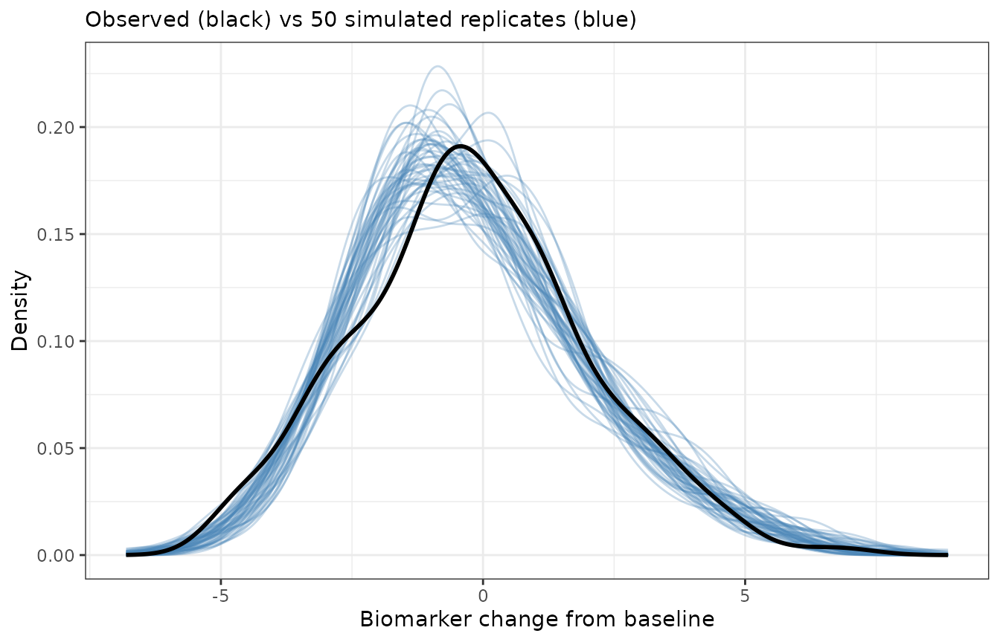
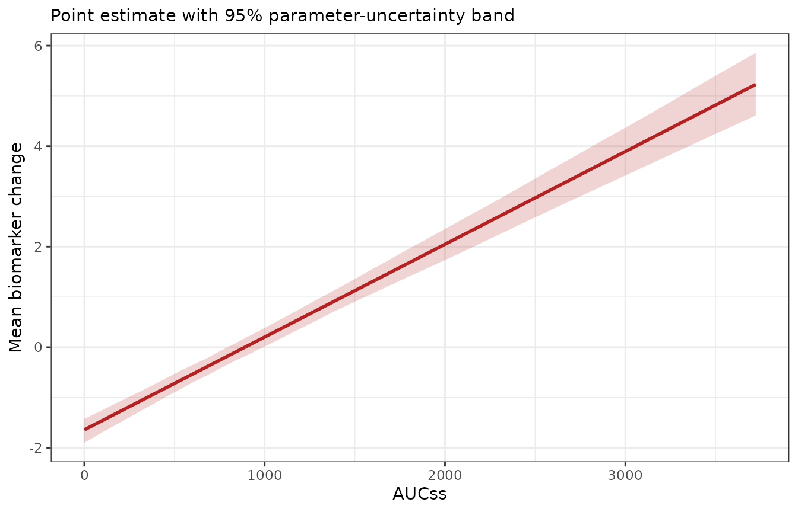

# Simulation

``` r

library(erglm)
library(tibble)
library(ggplot2)
theme_set(theme_bw())
```

Once a model has been fitted, it’s often useful to generate *new* data
from it: for predictive checks, for simulation-based intervals, or as
the input to some downstream analysis. The package offers two tools for
this, operating at different levels:

- **[`simulate()`](https://rdrr.io/r/stats/simulate.html)** is the
  high-level method. It generates complete replicate datasets from a
  fitted model, automatically propagating both the uncertainty in the
  parameter estimates and the observation-level noise.
- **[`erglm_fun()`](https://erglm.djnavarro.net/reference/erglm_fun.md)**
  is the low-level building block. It extracts the deterministic
  prediction function from a fitted model, letting you evaluate it at
  any parameter values and any data you choose – the raw material for
  building custom simulations by hand.

Both rely on the **mvtnorm** package for drawing parameter values, so it
needs to be installed. This article works through both tools using a
gaussian model, then shows that they generalise unchanged to the other
[`glm()`](https://rdrr.io/r/stats/glm.html) families erglm supports.

``` r

mod <- erglm_model(biomarker_change ~ aucss, erglm_data, family = gaussian())
```

## The `simulate()` method

Calling [`simulate()`](https://rdrr.io/r/stats/simulate.html) generates
one or more replicate datasets. The number of replicates is set by
`nsim`, and a `seed` can be supplied for reproducibility:

``` r

sim1 <- simulate(mod, nsim = 1, seed = 1)
sim1
#>     dat_id sim_id       mu       val coef_(Intercept) coef_aucss  aucss
#> 1        1      1 -0.43692 -1.686464           -1.716     0.0019  673.1
#> 2        2      1  3.61559  6.001067           -1.716     0.0019 2806.1
#> 3        3      1 -1.71572 -1.222992           -1.716     0.0019    0.0
#> 4        4      1  0.50534 -0.721537           -1.716     0.0019 1169.0
#> 5        5      1 -0.99891 -0.270042           -1.716     0.0019  377.3
#> 6        6      1 -1.09430  0.009739           -1.716     0.0019  327.1
#> 7        7      1 -1.71572 -0.854731           -1.716     0.0019    0.0
#> 8        8      1  0.57866  0.122004           -1.716     0.0019 1207.6
#> 9        9      1 -1.71572  0.544902           -1.716     0.0019    0.0
#> 10      10      1 -1.23392 -0.650978           -1.716     0.0019  253.6
#> 11      11      1  4.25999  3.331026           -1.716     0.0019 3145.3
#> 12      12      1 -0.94684 -4.258556           -1.716     0.0019  404.7
#> 13      13      1  0.94725  2.629399           -1.716     0.0019 1401.6
#> 14      14      1 -1.71572 -1.782908           -1.716     0.0019    0.0
#> 15      15      1  0.87262  0.848415           -1.716     0.0019 1362.4
#> 16      16      1 -0.84474  0.566613           -1.716     0.0019  458.4
#> 17      17      1 -0.60811  0.619886           -1.716     0.0019  583.0
#> 18      18      1 -1.71572 -0.827635           -1.716     0.0019    0.0
#> 19      19      1 -0.98264  0.391542           -1.716     0.0019  385.9
#> 20      20      1 -1.71572 -0.546161           -1.716     0.0019    0.0
#> 21      21      1 -1.71572 -1.604217           -1.716     0.0019    0.0
#> 22      22      1  1.36208 -1.612666           -1.716     0.0019 1620.0
#> 23      23      1 -1.71572 -0.788870           -1.716     0.0019    0.0
#> 24      24      1 -1.71572 -1.799648           -1.716     0.0019    0.0
#> 25      25      1  0.43305  0.200081           -1.716     0.0019 1131.0
#> 26      26      1  0.61457 -1.584697           -1.716     0.0019 1226.5
#> 27      27      1 -1.71572 -2.430711           -1.716     0.0019    0.0
#> 28      28      1 -1.71572 -1.090754           -1.716     0.0019    0.0
#> 29      29      1  1.06080  3.092480           -1.716     0.0019 1461.4
#> 30      30      1  4.46981  4.316108           -1.716     0.0019 3255.7
#> 31      31      1 -0.13271  0.446990           -1.716     0.0019  833.2
#> 32      32      1 -0.61506 -0.695519           -1.716     0.0019  579.3
#> 33      33      1 -0.90208 -2.961246           -1.716     0.0019  428.3
#> 34      34      1  0.30002 -0.320531           -1.716     0.0019 1061.0
#> 35      35      1  0.39744 -0.192160           -1.716     0.0019 1112.3
#> 36      36      1 -1.71572 -1.804410           -1.716     0.0019    0.0
#> 37      37      1 -1.19450  0.450407           -1.716     0.0019  274.3
#> 38      38      1  0.87713  2.018334           -1.716     0.0019 1364.7
#> 39      39      1 -0.98257 -1.228591           -1.716     0.0019  385.9
#> 40      40      1  1.04977  0.670909           -1.716     0.0019 1455.6
#> 41      41      1 -1.71572 -0.673523           -1.716     0.0019    0.0
#> 42      42      1  2.75954  3.591934           -1.716     0.0019 2355.5
#> 43      43      1  0.41719 -0.612732           -1.716     0.0019 1122.6
#> 44      44      1 -0.31662 -1.374559           -1.716     0.0019  736.4
#> 45      45      1 -0.60603 -0.060856           -1.716     0.0019  584.1
#> 46      46      1 -0.06296  1.086250           -1.716     0.0019  869.9
#> 47      47      1  0.78669  0.618695           -1.716     0.0019 1317.1
#> 48      48      1 -0.98760  0.329947           -1.716     0.0019  383.2
#> 49      49      1 -1.71572 -1.120415           -1.716     0.0019    0.0
#> 50      50      1  3.37963  2.464441           -1.716     0.0019 2681.9
#> 51      51      1  1.87096  2.381053           -1.716     0.0019 1887.8
#> 52      52      1 -1.71572 -3.404493           -1.716     0.0019    0.0
#> 53      53      1 -1.71572  0.427134           -1.716     0.0019    0.0
#> 54      54      1 -0.20438  2.756977           -1.716     0.0019  795.5
#> 55      55      1 -1.71572 -2.264836           -1.716     0.0019    0.0
#> 56      56      1  5.35755  3.796223           -1.716     0.0019 3723.0
#> 57      57      1 -0.84483  0.007091           -1.716     0.0019  458.4
#> 58      58      1  4.08286  3.880910           -1.716     0.0019 3052.1
#> 59      59      1 -0.80203  2.789197           -1.716     0.0019  480.9
#> 60      60      1 -1.71572 -1.774394           -1.716     0.0019    0.0
#> 61      61      1  2.40862  3.440011           -1.716     0.0019 2170.8
#> 62      62      1 -0.21554 -0.173664           -1.716     0.0019  789.6
#> 63      63      1  5.20538  4.093942           -1.716     0.0019 3642.9
#> 64      64      1 -1.04282 -0.760509           -1.716     0.0019  354.2
#> 65      65      1 -1.71572 -4.414735           -1.716     0.0019    0.0
#> 66      66      1 -1.71572  0.475779           -1.716     0.0019    0.0
#> 67      67      1 -0.04892  0.180249           -1.716     0.0019  877.3
#> 68      68      1 -0.71641  2.532372           -1.716     0.0019  526.0
#> 69      69      1 -1.71572 -1.004671           -1.716     0.0019    0.0
#> 70      70      1  0.26779 -0.793815           -1.716     0.0019 1044.0
#> 71      71      1 -1.71572 -0.802476           -1.716     0.0019    0.0
#> 72      72      1  1.64209  0.245306           -1.716     0.0019 1767.4
#> 73      73      1  0.26836 -1.606245           -1.716     0.0019 1044.3
#> 74      74      1  2.87530  3.311112           -1.716     0.0019 2416.5
#> 75      75      1 -1.28590 -1.948769           -1.716     0.0019  226.2
#> 76      76      1  2.11344  2.115089           -1.716     0.0019 2015.5
#> 77      77      1 -1.71572 -1.604552           -1.716     0.0019    0.0
#> 78      78      1 -1.71572 -2.597248           -1.716     0.0019    0.0
#> 79      79      1  0.13518 -0.715166           -1.716     0.0019  974.2
#> 80      80      1  1.72072  1.518578           -1.716     0.0019 1808.8
#> 81      81      1 -0.25479  1.506846           -1.716     0.0019  769.0
#> 82      82      1 -0.58056 -2.858805           -1.716     0.0019  597.5
#> 83      83      1  1.79844  2.686587           -1.716     0.0019 1849.7
#> 84      84      1 -1.71572 -1.217845           -1.716     0.0019    0.0
#> 85      85      1 -1.71572 -0.126027           -1.716     0.0019    0.0
#> 86      86      1 -1.71572 -2.170574           -1.716     0.0019    0.0
#> 87      87      1 -1.71572 -1.162415           -1.716     0.0019    0.0
#> 88      88      1  0.59819  0.997595           -1.716     0.0019 1217.9
#> 89      89      1 -1.71572 -2.526966           -1.716     0.0019    0.0
#> 90      90      1 -0.38113  1.425032           -1.716     0.0019  702.5
#> 91      91      1  0.75802  2.493208           -1.716     0.0019 1302.0
#> 92      92      1 -0.86789  0.179162           -1.716     0.0019  446.2
#> 93      93      1 -1.22579  1.147061           -1.716     0.0019  257.9
#> 94      94      1  2.55150  3.386629           -1.716     0.0019 2246.0
#> 95      95      1 -1.71572 -3.624650           -1.716     0.0019    0.0
#> 96      96      1 -1.15578 -2.013002           -1.716     0.0019  294.7
#> 97      97      1 -1.71572 -3.546923           -1.716     0.0019    0.0
#> 98      98      1 -1.71572 -2.423609           -1.716     0.0019    0.0
#> 99      99      1 -1.71572 -2.643373           -1.716     0.0019    0.0
#> 100    100      1 -0.87744 -0.814467           -1.716     0.0019  441.2
#> 101    101      1 -0.79804 -2.160173           -1.716     0.0019  483.0
#> 102    102      1  1.71909  1.955395           -1.716     0.0019 1807.9
#> 103    103      1  0.95986 -0.018962           -1.716     0.0019 1408.3
#> 104    104      1 -0.20837  2.434312           -1.716     0.0019  793.4
#> 105    105      1 -0.15989  0.911833           -1.716     0.0019  818.9
#> 106    106      1 -1.40629 -0.045278           -1.716     0.0019  162.9
#> 107    107      1  4.38938  4.963870           -1.716     0.0019 3213.4
#> 108    108      1 -1.71572  0.799700           -1.716     0.0019    0.0
#> 109    109      1 -0.02376 -0.974395           -1.716     0.0019  890.6
#> 110    110      1  3.84006  3.149746           -1.716     0.0019 2924.3
#> 111    111      1 -1.71572  0.426025           -1.716     0.0019    0.0
#> 112    112      1  3.10900  2.135995           -1.716     0.0019 2539.5
#> 113    113      1 -0.32747 -0.637572           -1.716     0.0019  730.7
#> 114    114      1 -1.21493 -1.802309           -1.716     0.0019  263.6
#> 115    115      1  0.99300  0.514507           -1.716     0.0019 1425.7
#> 116    116      1 -1.71572 -2.133085           -1.716     0.0019    0.0
#> 117    117      1 -1.71572 -0.976740           -1.716     0.0019    0.0
#> 118    118      1 -0.83845 -1.103614           -1.716     0.0019  461.7
#> 119    119      1  2.63872  1.882141           -1.716     0.0019 2291.9
#> 120    120      1 -1.01834  0.989953           -1.716     0.0019  367.1
#> 121    121      1 -1.07128 -1.392147           -1.716     0.0019  339.2
#> 122    122      1 -1.71572 -1.984214           -1.716     0.0019    0.0
#> 123    123      1  2.16621  2.016392           -1.716     0.0019 2043.2
#> 124    124      1 -1.00344  0.062230           -1.716     0.0019  374.9
#> 125    125      1 -1.71572 -1.825720           -1.716     0.0019    0.0
#> 126    126      1 -1.71572 -1.771993           -1.716     0.0019    0.0
#> 127    127      1 -0.82051 -1.839825           -1.716     0.0019  471.2
#> 128    128      1  3.89029  3.405402           -1.716     0.0019 2950.7
#> 129    129      1  0.49366  0.583623           -1.716     0.0019 1162.9
#> 130    130      1 -0.70728 -1.587877           -1.716     0.0019  530.8
#> 131    131      1  0.19811  0.992878           -1.716     0.0019 1007.3
#> 132    132      1  1.28800 -0.982509           -1.716     0.0019 1581.0
#> 133    133      1  0.48305  0.941459           -1.716     0.0019 1157.3
#> 134    134      1 -1.28895 -3.586458           -1.716     0.0019  224.6
#> 135    135      1 -1.71572 -2.165777           -1.716     0.0019    0.0
#> 136    136      1 -1.24708 -2.037036           -1.716     0.0019  246.7
#> 137    137      1 -0.48914 -1.464242           -1.716     0.0019  645.6
#> 138    138      1 -1.71572 -1.800797           -1.716     0.0019    0.0
#> 139    139      1  0.37485 -2.487761           -1.716     0.0019 1100.4
#> 140    140      1 -1.71572  0.043669           -1.716     0.0019    0.0
#> 141    141      1 -0.52147 -3.011160           -1.716     0.0019  628.6
#> 142    142      1 -1.71572 -2.408850           -1.716     0.0019    0.0
#> 143    143      1 -1.16630 -2.834974           -1.716     0.0019  289.2
#> 144    144      1 -1.71572 -2.838443           -1.716     0.0019    0.0
#> 145    145      1  0.58000  3.701013           -1.716     0.0019 1208.3
#> 146    146      1  3.55716  3.583173           -1.716     0.0019 2775.4
#> 147    147      1  3.72839  1.804940           -1.716     0.0019 2865.5
#> 148    148      1  1.47158 -0.981672           -1.716     0.0019 1677.6
#> 149    149      1 -1.71572 -1.042536           -1.716     0.0019    0.0
#> 150    150      1  2.18250  2.154747           -1.716     0.0019 2051.8
#> 151    151      1 -1.71572 -2.191336           -1.716     0.0019    0.0
#> 152    152      1 -0.63640 -2.026106           -1.716     0.0019  568.1
#> 153    153      1 -1.71572 -3.939968           -1.716     0.0019    0.0
#> 154    154      1  0.30579 -1.301987           -1.716     0.0019 1064.0
#> 155    155      1  0.06093  1.556309           -1.716     0.0019  935.1
#> 156    156      1 -0.02899 -0.957990           -1.716     0.0019  887.8
#> 157    157      1 -0.55839 -2.628574           -1.716     0.0019  609.2
#> 158    158      1  3.12460  5.919812           -1.716     0.0019 2547.7
#> 159    159      1 -0.65023 -0.014560           -1.716     0.0019  560.8
#> 160    160      1 -1.06714 -1.423994           -1.716     0.0019  341.4
#> 161    161      1 -1.71572 -0.132930           -1.716     0.0019    0.0
#> 162    162      1 -1.71572 -0.390218           -1.716     0.0019    0.0
#> 163    163      1 -0.43436 -1.360332           -1.716     0.0019  674.4
#> 164    164      1  1.93278  5.231638           -1.716     0.0019 1920.4
#> 165    165      1 -1.35151 -1.732863           -1.716     0.0019  191.7
#> 166    166      1 -0.98892 -3.119019           -1.716     0.0019  382.5
#> 167    167      1 -1.71572 -1.931643           -1.716     0.0019    0.0
#> 168    168      1 -1.07082 -0.760481           -1.716     0.0019  339.4
#> 169    169      1 -1.71572  1.735484           -1.716     0.0019    0.0
#> 170    170      1 -1.71572 -1.557507           -1.716     0.0019    0.0
#> 171    171      1  1.17225  1.855615           -1.716     0.0019 1520.1
#> 172    172      1 -1.07158 -1.186946           -1.716     0.0019  339.0
#> 173    173      1 -0.01827 -0.517711           -1.716     0.0019  893.4
#> 174    174      1 -1.31190 -1.363830           -1.716     0.0019  212.5
#> 175    175      1 -1.71572 -0.537932           -1.716     0.0019    0.0
#> 176    176      1  0.87880  3.981984           -1.716     0.0019 1365.6
#> 177    177      1 -0.06860  1.467695           -1.716     0.0019  867.0
#> 178    178      1  2.94839  4.754617           -1.716     0.0019 2454.9
#> 179    179      1 -0.77056 -2.611803           -1.716     0.0019  497.5
#> 180    180      1  1.37246  2.843712           -1.716     0.0019 1625.5
#> 181    181      1  3.04287  3.371732           -1.716     0.0019 2504.7
#> 182    182      1 -0.16037 -2.354404           -1.716     0.0019  818.6
#> 183    183      1  1.07464  1.853743           -1.716     0.0019 1468.7
#> 184    184      1 -1.71572 -1.953108           -1.716     0.0019    0.0
#> 185    185      1 -0.75889  1.431163           -1.716     0.0019  503.6
#> 186    186      1 -1.71572 -2.861266           -1.716     0.0019    0.0
#> 187    187      1 -1.71572 -2.359028           -1.716     0.0019    0.0
#> 188    188      1 -1.71572 -3.100561           -1.716     0.0019    0.0
#> 189    189      1  2.61630  2.351472           -1.716     0.0019 2280.1
#> 190    190      1 -0.06700  0.534141           -1.716     0.0019  867.8
#> 191    191      1  0.36362 -0.730585           -1.716     0.0019 1094.5
#> 192    192      1 -0.17663  1.065059           -1.716     0.0019  810.1
#> 193    193      1  0.15356 -1.652926           -1.716     0.0019  983.9
#> 194    194      1  4.46913  2.902039           -1.716     0.0019 3255.4
#> 195    195      1  1.02689  3.181907           -1.716     0.0019 1443.6
#> 196    196      1 -1.71572 -3.234749           -1.716     0.0019    0.0
#> 197    197      1 -0.68804 -0.072001           -1.716     0.0019  540.9
#> 198    198      1 -1.71572 -2.285553           -1.716     0.0019    0.0
#> 199    199      1 -0.08876  0.523434           -1.716     0.0019  856.3
#> 200    200      1 -0.19728  2.328149           -1.716     0.0019  799.2
#> 201    201      1  1.61595  3.988429           -1.716     0.0019 1753.6
#> 202    202      1  3.23145  2.736632           -1.716     0.0019 2603.9
#> 203    203      1  3.18038 -0.236814           -1.716     0.0019 2577.0
#> 204    204      1 -0.96760  2.767241           -1.716     0.0019  393.8
#> 205    205      1  2.20800  3.205486           -1.716     0.0019 2065.2
#> 206    206      1 -1.71572 -0.906251           -1.716     0.0019    0.0
#> 207    207      1 -1.71572 -1.735754           -1.716     0.0019    0.0
#> 208    208      1  1.56045  2.323233           -1.716     0.0019 1724.4
#> 209    209      1 -1.71572 -1.961514           -1.716     0.0019    0.0
#> 210    210      1 -1.71572 -1.086637           -1.716     0.0019    0.0
#> 211    211      1  1.21423  0.615727           -1.716     0.0019 1542.2
#> 212    212      1 -0.73360 -2.782518           -1.716     0.0019  516.9
#> 213    213      1 -1.71572 -0.238568           -1.716     0.0019    0.0
#> 214    214      1 -0.33633  1.936200           -1.716     0.0019  726.0
#> 215    215      1 -0.44214 -0.903809           -1.716     0.0019  670.3
#> 216    216      1 -1.71572 -3.589805           -1.716     0.0019    0.0
#> 217    217      1 -1.71572 -0.755351           -1.716     0.0019    0.0
#> 218    218      1 -0.48371 -0.550561           -1.716     0.0019  648.5
#> 219    219      1  0.33989 -2.251852           -1.716     0.0019 1082.0
#> 220    220      1 -1.39040 -1.387211           -1.716     0.0019  171.2
#> 221    221      1  1.89744  0.954931           -1.716     0.0019 1901.8
#> 222    222      1 -1.71572 -2.225579           -1.716     0.0019    0.0
#> 223    223      1  1.78529  0.055822           -1.716     0.0019 1842.7
#> 224    224      1 -1.71572  0.980584           -1.716     0.0019    0.0
#> 225    225      1 -0.56965 -1.064801           -1.716     0.0019  603.2
#> 226    226      1 -1.71572 -4.116497           -1.716     0.0019    0.0
#> 227    227      1  2.01979  2.314661           -1.716     0.0019 1966.2
#> 228    228      1 -1.71572 -1.322181           -1.716     0.0019    0.0
#> 229    229      1 -1.71572 -3.189858           -1.716     0.0019    0.0
#> 230    230      1  0.60013 -3.719775           -1.716     0.0019 1218.9
#> 231    231      1 -1.27077 -2.228503           -1.716     0.0019  234.2
#> 232    232      1 -0.77271  0.080385           -1.716     0.0019  496.3
#> 233    233      1 -1.13893 -1.228236           -1.716     0.0019  303.6
#> 234    234      1 -0.43231 -0.579118           -1.716     0.0019  675.5
#> 235    235      1 -1.71572 -0.877102           -1.716     0.0019    0.0
#> 236    236      1 -1.08574 -2.859890           -1.716     0.0019  331.6
#> 237    237      1  2.60294  4.242987           -1.716     0.0019 2273.1
#> 238    238      1 -1.71572 -1.723708           -1.716     0.0019    0.0
#> 239    239      1  1.68470  2.742368           -1.716     0.0019 1789.8
#> 240    240      1  1.78081  3.327143           -1.716     0.0019 1840.4
#> 241    241      1 -0.58679 -0.252616           -1.716     0.0019  594.2
#> 242    242      1  0.82804 -0.485924           -1.716     0.0019 1338.9
#> 243    243      1 -1.71572  0.023305           -1.716     0.0019    0.0
#> 244    244      1 -1.04547 -4.036383           -1.716     0.0019  352.8
#> 245    245      1 -1.28070 -2.095344           -1.716     0.0019  229.0
#> 246    246      1 -1.71572 -2.098030           -1.716     0.0019    0.0
#> 247    247      1  4.08851  3.840102           -1.716     0.0019 3055.0
#> 248    248      1  0.20741  1.733342           -1.716     0.0019 1012.2
#> 249    249      1 -1.71572 -1.512020           -1.716     0.0019    0.0
#> 250    250      1 -1.71572 -1.106865           -1.716     0.0019    0.0
#> 251    251      1 -0.57359 -0.677749           -1.716     0.0019  601.2
#> 252    252      1 -1.00790 -1.378241           -1.716     0.0019  372.6
#> 253    253      1 -1.09482 -0.054742           -1.716     0.0019  326.8
#> 254    254      1  3.00529  4.719288           -1.716     0.0019 2484.9
#> 255    255      1 -1.31994 -4.913377           -1.716     0.0019  208.3
#> 256    256      1 -1.71572 -0.859279           -1.716     0.0019    0.0
#> 257    257      1 -1.71572 -1.155378           -1.716     0.0019    0.0
#> 258    258      1 -1.71572 -2.351635           -1.716     0.0019    0.0
#> 259    259      1 -1.17069  0.251394           -1.716     0.0019  286.9
#> 260    260      1 -1.71572 -2.297757           -1.716     0.0019    0.0
#> 261    261      1 -0.41262 -0.837787           -1.716     0.0019  685.9
#> 262    262      1 -0.88836  0.393759           -1.716     0.0019  435.5
#> 263    263      1 -0.06682  2.504602           -1.716     0.0019  867.9
#> 264    264      1 -1.71572 -1.311894           -1.716     0.0019    0.0
#> 265    265      1 -1.71572 -2.347023           -1.716     0.0019    0.0
#> 266    266      1  0.27607 -1.502050           -1.716     0.0019 1048.4
#> 267    267      1 -0.86679 -1.361799           -1.716     0.0019  446.8
#> 268    268      1 -0.13258 -1.537938           -1.716     0.0019  833.3
#> 269    269      1 -0.03582 -0.423015           -1.716     0.0019  884.2
#> 270    270      1 -1.71572 -1.125988           -1.716     0.0019    0.0
#> 271    271      1 -1.71572 -2.989529           -1.716     0.0019    0.0
#> 272    272      1  2.39835  6.359739           -1.716     0.0019 2165.4
#> 273    273      1  0.41564  0.648932           -1.716     0.0019 1121.8
#> 274    274      1 -1.71572 -0.025678           -1.716     0.0019    0.0
#> 275    275      1 -0.14320 -3.566211           -1.716     0.0019  827.7
#> 276    276      1  0.68870  1.796747           -1.716     0.0019 1265.6
#> 277    277      1 -1.71572 -3.683944           -1.716     0.0019    0.0
#> 278    278      1 -0.47348  0.901938           -1.716     0.0019  653.8
#> 279    279      1  0.16830  0.763636           -1.716     0.0019  991.6
#> 280    280      1 -0.82226 -1.431654           -1.716     0.0019  470.3
#> 281    281      1 -1.71572  0.264493           -1.716     0.0019    0.0
#> 282    282      1 -1.71572 -2.764293           -1.716     0.0019    0.0
#> 283    283      1  3.01607  2.147858           -1.716     0.0019 2490.6
#> 284    284      1 -1.19522 -2.692154           -1.716     0.0019  274.0
#> 285    285      1 -1.00111 -2.000265           -1.716     0.0019  376.1
#> 286    286      1 -1.71572 -0.302349           -1.716     0.0019    0.0
#> 287    287      1  4.18672  4.835251           -1.716     0.0019 3106.7
#> 288    288      1 -1.71572 -0.212667           -1.716     0.0019    0.0
#> 289    289      1 -1.71572 -2.299075           -1.716     0.0019    0.0
#> 290    290      1 -1.71572 -1.152917           -1.716     0.0019    0.0
#> 291    291      1 -1.71572 -1.350609           -1.716     0.0019    0.0
#> 292    292      1 -1.71572 -3.848449           -1.716     0.0019    0.0
#> 293    293      1 -0.17776  2.481592           -1.716     0.0019  809.5
#> 294    294      1  3.19528  3.396322           -1.716     0.0019 2584.9
#> 295    295      1 -1.71572 -0.570890           -1.716     0.0019    0.0
#> 296    296      1 -1.71572 -0.287468           -1.716     0.0019    0.0
#> 297    297      1 -1.71572 -1.791330           -1.716     0.0019    0.0
#> 298    298      1 -1.71572 -2.173013           -1.716     0.0019    0.0
#> 299    299      1  0.18579  1.522128           -1.716     0.0019 1000.9
#> 300    300      1 -1.27748 -2.843545           -1.716     0.0019  230.7
```

### What `simulate()` actually does

Generating a replicate involves two distinct sources of randomness, and
[`simulate()`](https://rdrr.io/r/stats/simulate.html) accounts for both:

1.  **Parameter uncertainty.** A fresh parameter vector is drawn from
    the multivariate normal distribution implied by the estimates and
    their covariance matrix, using `coef(mod)` and `vcov(mod)`. This
    represents how uncertain we are about the fitted parameters
    themselves.
2.  **Observation noise.** Given that parameter draw, the expected
    response $`\mu_i`$ is evaluated at each observation’s exposure and
    covariates, and a response is generated around it. The noise model
    is family-appropriate: Bernoulli draws for `binomial`, Poisson draws
    for `poisson`, normal draws for `gaussian` (as here), and gamma
    draws for `Gamma`.

Because both sources are included, the simulated `val` column behaves
like a genuine new dataset drawn from the fitted model, not merely a
noiseless prediction.

### The output format

The result is a tidy, long-format data frame with `nsim`$`\times`$`nobs`
rows:

``` r

names(sim1)
#> [1] "dat_id"           "sim_id"           "mu"               "val"             
#> [5] "coef_(Intercept)" "coef_aucss"       "aucss"
```

The columns are:

- `dat_id` – an index identifying the original observation (row of the
  data).
- `sim_id` – which replicate the row belongs to (`1` to `nsim`).
- `mu` – the expected response (response scale) for that observation
  under the sampled parameters.
- `val` – the simulated response (the mean plus family-appropriate
  noise).
- the sampled coefficient values, prefixed `coef_*`
  (e.g. `` coef_`(Intercept)` ``, `coef_aucss`) to avoid colliding with
  predictor columns of the same name, repeated across all rows of a
  replicate – one parameter draw is used per replicate.
- the model’s predictor columns (`aucss`), carried along so you can
  group or plot by exposure and covariates.

Requesting several replicates stacks them, and the sampled coefficients
vary from one replicate to the next while staying constant within a
replicate:

``` r

sims <- simulate(mod, nsim = 50, seed = 1)
dim(sims)
#> [1] 15000     7

# one parameter draw per replicate
unique(sims[sims$sim_id <= 3, c("sim_id", "coef_(Intercept)", "coef_aucss")])
#>     sim_id coef_(Intercept) coef_aucss
#> 1        1           -1.716   0.001900
#> 301      2           -1.740   0.002017
#> 601      3           -1.606   0.001764
```

### A predictive check

A natural use of these replicates is a *predictive check*: if the model
is adequate, the distribution of simulated responses should resemble the
distribution of the observed response. Overlaying the density of the
observed `biomarker_change` on the densities of several simulated
replicates gives a quick visual check:

``` r

ggplot(sims, aes(val, group = sim_id)) +
  geom_line(stat = "density", colour = "steelblue", alpha = 0.3) +
  geom_line(
    aes(biomarker_change),
    data = erglm_data,
    stat = "density",
    inherit.aes = FALSE,
    colour = "black",
    linewidth = 1
  ) +
  labs(
    x = "Biomarker change from baseline",
    y = "Density",
    subtitle = "Observed (black) vs 50 simulated replicates (blue)"
  )
```



The observed distribution sits comfortably within the spread of the
simulated replicates, which is what we’d hope to see from a well-fitting
model.

## The `erglm_fun()` tool

Where [`simulate()`](https://rdrr.io/r/stats/simulate.html) bundles
parameter sampling and noise generation together,
[`erglm_fun()`](https://erglm.djnavarro.net/reference/erglm_fun.md)
exposes the deterministic core: the prediction function itself. It
returns a function of two arguments, `param` and `data`, both of which
default to the values used when the model was fitted:

``` r

f <- erglm_fun(mod)

# with no arguments, it reproduces the fitted values
head(f())
#> [1] -0.4013  3.5360 -1.6437  0.5142 -0.9473 -1.0400
head(fitted(mod))
#>       1       2       3       4       5       6 
#> -0.4013  3.5360 -1.6437  0.5142 -0.9473 -1.0400
```

Because you control both arguments, you can evaluate the model in
situations the original fit never saw. Supplying `param` lets you ask
counterfactual “what if the parameters were different?” questions – for
example, setting the intercept to zero:

``` r

alt <- coef(mod)
alt["(Intercept)"] <- 0
head(f(param = alt))
#> [1] 1.2424 5.1797 0.0000 2.1579 0.6964 0.6037
```

Supplying `data` lets you evaluate the curve at exposures and covariate
values of your choosing – for instance, tracing the exposure-response
relationship over a grid of `aucss` values:

``` r

grid <- tibble(aucss = c(0, 1000, 2000, 3000, 4000))
f(data = grid)
#> [1] -1.6437  0.2022  2.0480  3.8939  5.7397
```

By default
[`erglm_fun()`](https://erglm.djnavarro.net/reference/erglm_fun.md)
returns predictions on the response scale (`type = "response"`); pass
`type = "link"` for the link scale.

### Building a custom simulation

[`erglm_fun()`](https://erglm.djnavarro.net/reference/erglm_fun.md) is
the tool to reach for when
[`simulate()`](https://rdrr.io/r/stats/simulate.html) doesn’t do exactly
what you need and you want to assemble the pieces yourself. As an
illustration, we can build an exposure-response curve with a
parameter-uncertainty band by combining
[`erglm_fun()`](https://erglm.djnavarro.net/reference/erglm_fun.md) with
a manual parameter draw – reproducing, at a lower level, the
parameter-sampling step that
[`simulate()`](https://rdrr.io/r/stats/simulate.html) performs
internally.

The recipe is: draw many parameter vectors from the estimated sampling
distribution, evaluate the curve over an exposure grid for each draw,
and summarise the resulting family of curves pointwise.

``` r

set.seed(1)
n_draws <- 500
draws <- mvtnorm::rmvnorm(n_draws, mean = coef(mod), sigma = vcov(mod))
colnames(draws) <- names(coef(mod))

curve_grid <- tibble(aucss = seq(0, max(erglm_data$aucss), length.out = 100))

# evaluate the curve for every parameter draw
curves <- apply(draws, 1, function(p) f(data = curve_grid, param = p))

# summarise pointwise across draws
band <- tibble(
  aucss = curve_grid$aucss,
  fit = f(data = curve_grid),
  lwr = apply(curves, 1, stats::quantile, probs = 0.025),
  upr = apply(curves, 1, stats::quantile, probs = 0.975)
)

ggplot(band, aes(aucss)) +
  geom_ribbon(aes(ymin = lwr, ymax = upr), fill = "firebrick", alpha = 0.2) +
  geom_line(aes(y = fit), colour = "firebrick", linewidth = 1) +
  labs(x = "AUCss", y = "Mean biomarker change", subtitle = "Point estimate with 95% parameter-uncertainty band")
```



This band reflects *only* parameter uncertainty, because we summarised
the mean curve and never added residual noise – it’s the analogue of a
confidence band. Adding a step that draws
`rnorm(..., sd = sqrt(summary(mod)$dispersion))` around each evaluated
mean would turn it into a prediction band that also captures observation
noise, which is precisely the extra ingredient
[`simulate()`](https://rdrr.io/r/stats/simulate.html) supplies for you.
This is the essential trade-off between the two tools:
[`simulate()`](https://rdrr.io/r/stats/simulate.html) is convenient and
complete, while
[`erglm_fun()`](https://erglm.djnavarro.net/reference/erglm_fun.md) is
transparent and fully under your control.

## The same tools across other `glm()` families

Both tools work unchanged for the other families erglm supports; only
the noise model and scale differ. For a binomial model, `mu` is the
fitted probability and `val` is a 0/1 outcome drawn from
$`\text{Bernoulli}(\mu)`$:

``` r

mod_b <- erglm_model(ae1 ~ aucss + sex, erglm_data, family = binomial())

sim_b <- simulate(mod_b, nsim = 2, seed = 1)
sort(unique(sim_b$val))
#> [1] 0 1

f_b <- erglm_fun(mod_b)
range(f_b())
#> [1] 0.1234 1.0000
```

For a Poisson model, `val` is drawn from $`\text{Poisson}(\mu)`$ and is
always a non-negative integer:

``` r

mod_p <- erglm_model(ae_count ~ aucss + sex, erglm_data, family = poisson())

sim_p <- simulate(mod_p, nsim = 2, seed = 1)
all(sim_p$val == round(sim_p$val)) && all(sim_p$val >= 0)
#> [1] TRUE
```

Everything else – custom parameter values, custom data grids, and
building your own simulations on top of the prediction function –
carries over exactly as in the gaussian case.

## Visual predictive checks

For a VPC-style plot comparing observed and simulated response rates,
see the companion `erplots` package’s `er_vpc()` mini-grammar. Passing a
fitted erglm model directly to `er_vpc_add_simulated()`
(`er_vpc_add_simulated(model = mod_b)`) builds the necessary simulated
replicates internally via
[`erplots::er_simulate()`](https://erplots.djnavarro.net/reference/er_model_interface.html)
– which erglm implements on top of the same parameter-sampling/noise
machinery [`simulate()`](https://rdrr.io/r/stats/simulate.html) uses –
so no separate erglm-side VPC helper is needed. See erplots’ [Visual
predictive checks](https://erplots.djnavarro.net/articles/plot-vpc.html)
article for the full pipeline
(`er_vpc() |> er_vpc_add_observed() |> er_vpc_add_simulated(model = ...) |> plot()`).

## Notes

- Both [`simulate()`](https://rdrr.io/r/stats/simulate.html) and
  [`erglm_fun()`](https://erglm.djnavarro.net/reference/erglm_fun.md)’s
  uncertainty workflows draw parameters with **mvtnorm**, which must be
  installed.
- [`simulate()`](https://rdrr.io/r/stats/simulate.html) captures two
  sources of variability (parameter uncertainty and observation noise);
  a band built from
  [`erglm_fun()`](https://erglm.djnavarro.net/reference/erglm_fun.md)
  captures only whatever you choose to include, so decide deliberately
  whether you want a confidence-style band (means only) or a
  prediction-style band (means plus residual noise).
- For a quick analytic interval on the mean, prefer
  [`erglm_predict()`](https://erglm.djnavarro.net/reference/erglm_predict.md)
  or `predict(..., se.fit = TRUE)`, described in the modelling and
  methods articles. Reach for
  [`simulate()`](https://rdrr.io/r/stats/simulate.html) and
  [`erglm_fun()`](https://erglm.djnavarro.net/reference/erglm_fun.md)
  when you need replicate datasets or bespoke simulation logic.
- Other [`glm()`](https://rdrr.io/r/stats/glm.html) families are not
  currently supported by
  [`simulate()`](https://rdrr.io/r/stats/simulate.html) and will raise
  an informative error rather than silently falling back to an
  expectation-only draw.
